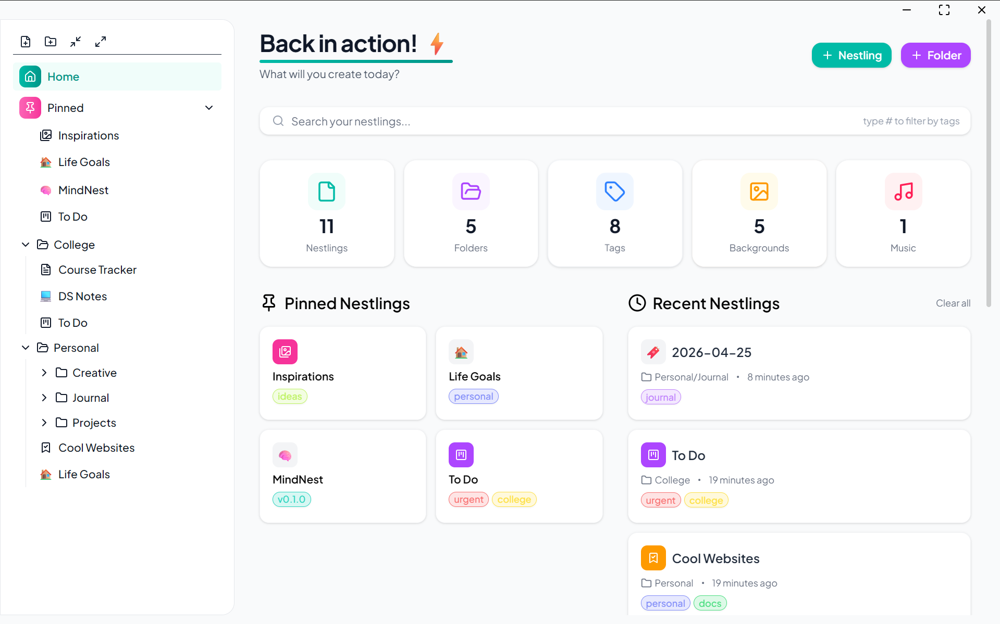
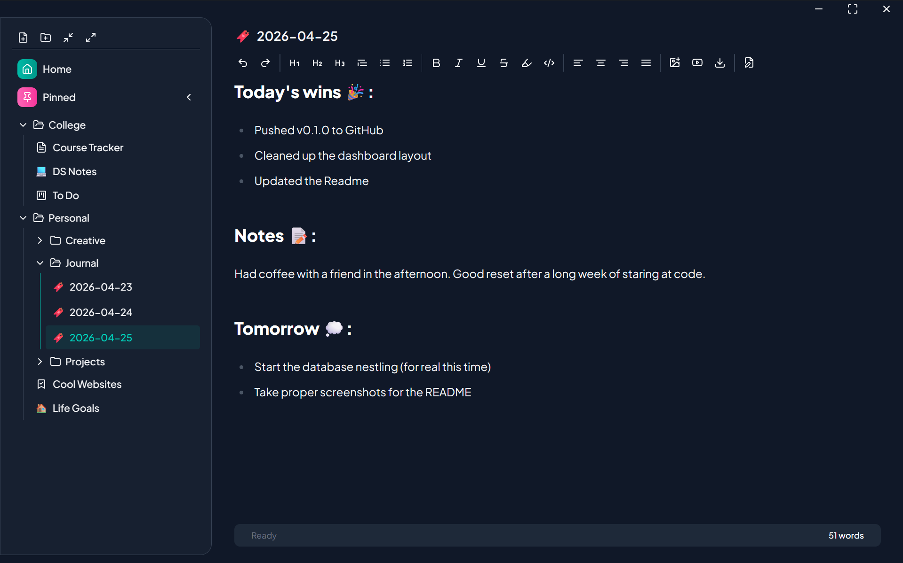
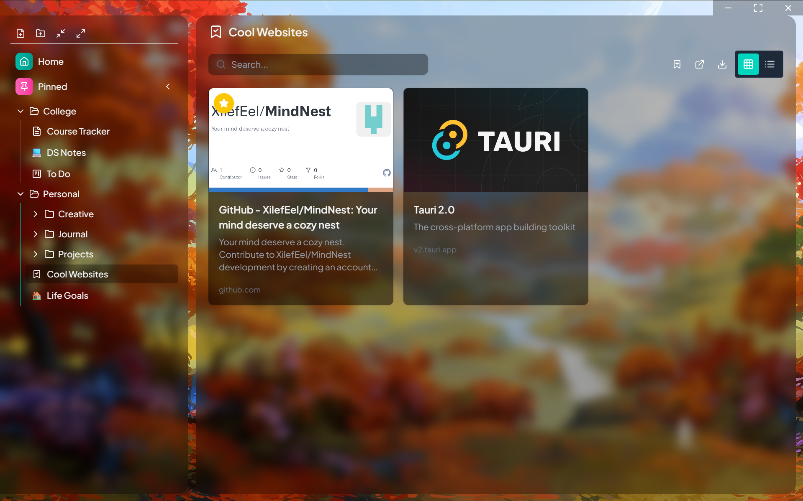

# MindNest

> Your mind deserves a cozy nest. 🪺

MindNest is an all-in-one desktop productivity app where you create **Nests** (workspaces) and fill them with whatever **Nestlings** (tools) you need, like notes, boards, planners, galleries, bookmarks, mind maps, and more.

Built with Tauri and React for beautiful UI and native performance.

## Screenshots





## Tech Stack

**Frontend:** React, TypeScript, Tailwind, shadcn/ui

**State Management:** Zustand

**Backend:** Tauri, SQLite

**Libraries:** DnD Kit, Tiptap, XYFlow

## Features

- **Nests**: Personalized workspaces with a built-in home page.
- **Nestlings**: Building blocks you can add to your nests. You can make:
  - 📝 Notes
  - 📋 Boards
  - 📅 Planners
  - 🖼️ Galleries
  - 🔖 Bookmarks
  - 🧠 Mind Maps
  - 🗄️ Databases _(coming soon)_
- Folders and Tags
- Sidebar with Drag & Drop
- Emoji Icons Picker for Nestlings
- Upload Background Image and Music to Nests
- Adaptive Glassmorphism Design
- Keyboard Shortcuts
- Context Menus
- Light, Dark and System Theme

## Requirements

- [Node.js](https://nodejs.org/)
- [Rust](https://rustup.rs/)
- [Tauri CLI prerequisites](https://tauri.app/start/prerequisites/)

## Run Locally

```bash
git clone https://github.com/XilefEel/MindNest.git
cd mindnest
npm install
npm run tauri dev
```

## Roadmap

- Database Nestlings
- Export Nests
- Share and Discover Nests
- Cross Device Sync

## License

[MIT](./LICENSE)
